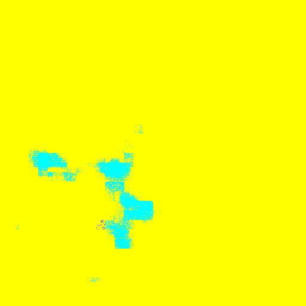

# HW1 Report for DLCV

## Part 1

#### 1. Network Architecture of method A

#### 2. Accuaracy

The Accuracy of the model A is 0.38.

The Accuracy of the model B is ==TODO==.

#### 3. Implementation details of model A

Trying to implement a LeNet for 3 channels inputs, the number of channels of the first convolution layer is increased to 18, following by a 1x1 convolution layer to reduce the number of channels to 6 again. Even though the results are not ideal, this is the highest for different permutations of layers.

A SGD optimizer was used for this task, with 0.01 learnging rate. As the task is an classification problem, the loss function was set to be Cross Entropy Loss.

#### 4. Implementation details of model B

The model B adopted ResNet50 with pretrained weights provided by torchvision. The main diffenrt is that ResNet50 is a much deeper network, and using residual blocks to avoid gradient vanishing/exploring. More features and high-level features can be extracted from the images, which boost up the accuracy.

To avoid overfitting, `RandomHorizontalFlip` and `RandomResizedCrop` are used in model B.

#### 5. PCA of the second last layer of model A

    
    
    
(left) PCA after 6 epochs. (right) PCA after 27 epochs

As the model A performs badly, it's hard to interpret the PCA plot. Moreover, with over 50 classes, saying that some of the classes were seperated better along the training, such as the dots in Cyan, is a bit unrealistic.

#### 6. tSNE of the second last layer of model A

    
    
tSNE at the start.

    
    
tSNE after 6 epochs.

    
    
tSNE after 27 epochs.

Similar to the PCA plot, one might be able to say that speration was getting better, such as the orange dots and Brown dots were getting more pronouncing though out the training, but it's clearly not easily seperable.

## Part 2

#### 1. VGG16-FCN32s

#### 2. VGG16-FCN8s

Noticing that the label 2 (Rangeland) performed tragically in the model A, I took a look at the masks. I believed that identifying Rangeland requires details of the images, so I decided to try FCN8s, as this model used the information from layers with higher resolution.

The implementation is different from those on the internet, as we have 512x512 as input, and I didn't do the cross-channels transforms before upsampling.

#### 3. mIoUs of models

The mIoU of the model A is 0.687858

The mIoU of the model B is 0.699997

#### 4. Predicted Masks

    
    
    
    
Predicted masks for 0013.png at epoch = 0 (left), 19 (center), 39 (right).

    
    
    
    
Predicted masks for 0062.png at epoch = 0 (left), 19 (center), 39 (right).

    
    
    
    
Predicted masks for 0104.png at epoch = 0 (left), 19 (center), 39 (right).

