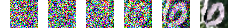

# HW2 Report for DLCV

## DCGAN

#### 1. Models

##### model A

```python
DCGANGenerator(
  (main): Sequential(
    (0): ConvTranspose2d(100, 512, kernel_size=(4, 4), stride=(1, 1), bias=False)
    (1): BatchNorm2d(512, eps=1e-05, momentum=0.1, affine=True, track_running_stats=True)
    (2): ReLU(negative_slope=0.01, inplace=True)
    (3): ConvTranspose2d(512, 256, kernel_size=(4, 4), stride=(2, 2), padding=(1, 1), bias=False)
    (4): BatchNorm2d(256, eps=1e-05, momentum=0.1, affine=True, track_running_stats=True)
    (5): ReLU(negative_slope=0.01, inplace=True)
    (6): ConvTranspose2d(256, 128, kernel_size=(4, 4), stride=(2, 2), padding=(1, 1), bias=False)
    (7): BatchNorm2d(128, eps=1e-05, momentum=0.1, affine=True, track_running_stats=True)
    (8): ReLU(negative_slope=0.01, inplace=True)
    (9): ConvTranspose2d(128, 64, kernel_size=(4, 4), stride=(2, 2), padding=(1, 1), bias=False)
    (10): BatchNorm2d(64, eps=1e-05, momentum=0.1, affine=True, track_running_stats=True)
    (11): ReLU(negative_slope=0.01, inplace=True)
    (12): ConvTranspose2d(64, 3, kernel_size=(4, 4), stride=(2, 2), padding=(1, 1), bias=False)
    (13): Tanh()
  )
)
DCGANDiscriminator(
  (main): Sequential(
    (0): Conv2d(3, 64, kernel_size=(4, 4), stride=(2, 2), padding=(1, 1), bias=False)
    (1): ReLU(negative_slope=0.2, inplace=True)
    (2): Conv2d(64, 128, kernel_size=(4, 4), stride=(2, 2), padding=(1, 1), bias=False)
    (3): BatchNorm2d(128, eps=1e-05, momentum=0.1, affine=True, track_running_stats=True)
    (4): ReLU(negative_slope=0.2, inplace=True)
    (5): Conv2d(128, 256, kernel_size=(4, 4), stride=(2, 2), padding=(1, 1), bias=False)
    (6): BatchNorm2d(256, eps=1e-05, momentum=0.1, affine=True, track_running_stats=True)
    (7): ReLU(negative_slope=0.2, inplace=True)
    (8): Conv2d(256, 512, kernel_size=(4, 4), stride=(2, 2), padding=(1, 1), bias=False)
    (9): BatchNorm2d(512, eps=1e-05, momentum=0.1, affine=True, track_running_stats=True)
    (10): ReLU(negative_slope=0.2, inplace=True)
    (11): Conv2d(512, 1, kernel_size=(4, 4), stride=(1, 1), bias=False)
    (12): Sigmoid()
  )
)
```

##### model B

```python
DCGANGenerator(
  (main): Sequential(
    (0): ConvTranspose2d(100, 512, kernel_size=(4, 4), stride=(1, 1), bias=False)
    (1): BatchNorm2d(512, eps=1e-05, momentum=0.1, affine=True, track_running_stats=True)
    (2): LeakyReLU(negative_slope=0.01, inplace=True)
    (3): ConvTranspose2d(512, 256, kernel_size=(4, 4), stride=(2, 2), padding=(1, 1), bias=False)
    (4): BatchNorm2d(256, eps=1e-05, momentum=0.1, affine=True, track_running_stats=True)
    (5): LeakyReLU(negative_slope=0.01, inplace=True)
    (6): ConvTranspose2d(256, 128, kernel_size=(4, 4), stride=(2, 2), padding=(1, 1), bias=False)
    (7): BatchNorm2d(128, eps=1e-05, momentum=0.1, affine=True, track_running_stats=True)
    (8): LeakyReLU(negative_slope=0.01, inplace=True)
    (9): ConvTranspose2d(128, 64, kernel_size=(4, 4), stride=(2, 2), padding=(1, 1), bias=False)
    (10): BatchNorm2d(64, eps=1e-05, momentum=0.1, affine=True, track_running_stats=True)
    (11): LeakyReLU(negative_slope=0.01, inplace=True)
    (12): ConvTranspose2d(64, 3, kernel_size=(4, 4), stride=(2, 2), padding=(1, 1), bias=False)
    (13): Tanh()
  )
)
DCGANDiscriminator(
  (main): Sequential(
    (0): Conv2d(3, 64, kernel_size=(4, 4), stride=(2, 2), padding=(1, 1), bias=False)
    (1): LeakyReLU(negative_slope=0.2, inplace=True)
    (2): Conv2d(64, 128, kernel_size=(4, 4), stride=(2, 2), padding=(1, 1), bias=False)
    (3): BatchNorm2d(128, eps=1e-05, momentum=0.1, affine=True, track_running_stats=True)
    (4): LeakyReLU(negative_slope=0.2, inplace=True)
    (5): Conv2d(128, 256, kernel_size=(4, 4), stride=(2, 2), padding=(1, 1), bias=False)
    (6): BatchNorm2d(256, eps=1e-05, momentum=0.1, affine=True, track_running_stats=True)
    (7): LeakyReLU(negative_slope=0.2, inplace=True)
    (8): Conv2d(256, 512, kernel_size=(4, 4), stride=(2, 2), padding=(1, 1), bias=False)
    (9): BatchNorm2d(512, eps=1e-05, momentum=0.1, affine=True, track_running_stats=True)
    (10): LeakyReLU(negative_slope=0.2, inplace=True)
    (11): Conv2d(512, 1, kernel_size=(4, 4), stride=(1, 1), bias=False)
    (12): Sigmoid()
  )
)
```

#### 2. Images Comparison

<div style="text-align:center">
    
    <p><font size=1>Model A</font></p>
    
    <p><font size=1>Model B</p>
</div>

#### 3. Discussion

I first was struggling to get the FID down. The faces were clear, so the regonition score was good, but the images need some dehazing. The reason, I guess, is that I was useing the mean and std of the traning set, instead of simply stretching the range from [0, 1] to [-1, 1]. Even with the "invert normalization", it's not better than let the model learns itself.

The second thing that I tried was using the SGD for discriminator, as the tips suggests. The model can learn faster with high learning rate, yet still perform relatively will the the recognition score. However, the FID will stuck at 40, no matter how "soft" the label is. Using adam (adamW I used) with low beta1, the discriminator and the generator can still change direction fast, while having good result at the end of the training.

The soft labels, however, is the most important tips in my opinion. It seems to open a free space for the generator.

I also observed the beauty of the Taipei city in the sunrise, thanks to the T4 on Colab.


## DDPM

#### 1. Implementation

As the original paper suggests, I used 1000 noise steps and a UNet as the core. In afraid of breaking the time and VRAM limit, I will use 500 noise steps in inference.

The UNet I used has 3 down sampling layers, 2 bottleneck layers, and 3 upsampling layers. In trying to speed up the inference process, a bottleneck layer is removed. With the EMA inplaced, the result is relatively good (digit classification accuary around 90%), but the effiency is not good.

```python
UNet(
  (label_emb): Embedding(10, 256)
  (inc): DoubleConv(
    (double_conv): Sequential(
      (0): Conv2d(3, 64, kernel_size=(3, 3), stride=(1, 1), padding=(1, 1), bias=False)
      (1): GroupNorm(1, 64, eps=1e-05, affine=True)
      (2): GELU(approximate=none)
      (3): Conv2d(64, 64, kernel_size=(3, 3), stride=(1, 1), padding=(1, 1), bias=False)
      (4): GroupNorm(1, 64, eps=1e-05, affine=True)
    )
  )
  (down1): Down(
    (maxpool_conv): Sequential(
      (0): MaxPool2d(kernel_size=2, stride=2, padding=0, dilation=1, ceil_mode=False)
      (1): DoubleConv(
        (double_conv): Sequential(
          (0): Conv2d(64, 64, kernel_size=(3, 3), stride=(1, 1), padding=(1, 1), bias=False)
          (1): GroupNorm(1, 64, eps=1e-05, affine=True)
          (2): GELU(approximate=none)
          (3): Conv2d(64, 64, kernel_size=(3, 3), stride=(1, 1), padding=(1, 1), bias=False)
          (4): GroupNorm(1, 64, eps=1e-05, affine=True)
        )
      )
      (2): DoubleConv(
        (double_conv): Sequential(
          (0): Conv2d(64, 128, kernel_size=(3, 3), stride=(1, 1), padding=(1, 1), bias=False)
          (1): GroupNorm(1, 128, eps=1e-05, affine=True)
          (2): GELU(approximate=none)
          (3): Conv2d(128, 128, kernel_size=(3, 3), stride=(1, 1), padding=(1, 1), bias=False)
          (4): GroupNorm(1, 128, eps=1e-05, affine=True)
        )
      )
    )
    (emb_layer): Sequential(
      (0): SiLU()
      (1): Linear(in_features=256, out_features=128, bias=True)
    )
  )
  (sa1): SelfAttention(
    (mha): MultiheadAttention(
      (out_proj): NonDynamicallyQuantizableLinear(in_features=128, out_features=128, bias=True)
    )
    (ln): LayerNorm((128,), eps=1e-05, elementwise_affine=True)
    (ff_self): Sequential(
      (0): LayerNorm((128,), eps=1e-05, elementwise_affine=True)
      (1): Linear(in_features=128, out_features=128, bias=True)
      (2): GELU(approximate=none)
      (3): Linear(in_features=128, out_features=128, bias=True)
    )
  )
  (down2): Down(
    (maxpool_conv): Sequential(
      (0): MaxPool2d(kernel_size=2, stride=2, padding=0, dilation=1, ceil_mode=False)
      (1): DoubleConv(
        (double_conv): Sequential(
          (0): Conv2d(128, 128, kernel_size=(3, 3), stride=(1, 1), padding=(1, 1), bias=False)
          (1): GroupNorm(1, 128, eps=1e-05, affine=True)
          (2): GELU(approximate=none)
          (3): Conv2d(128, 128, kernel_size=(3, 3), stride=(1, 1), padding=(1, 1), bias=False)
          (4): GroupNorm(1, 128, eps=1e-05, affine=True)
        )
      )
      (2): DoubleConv(
        (double_conv): Sequential(
          (0): Conv2d(128, 256, kernel_size=(3, 3), stride=(1, 1), padding=(1, 1), bias=False)
          (1): GroupNorm(1, 256, eps=1e-05, affine=True)
          (2): GELU(approximate=none)
          (3): Conv2d(256, 256, kernel_size=(3, 3), stride=(1, 1), padding=(1, 1), bias=False)
          (4): GroupNorm(1, 256, eps=1e-05, affine=True)
        )
      )
    )
    (emb_layer): Sequential(
      (0): SiLU()
      (1): Linear(in_features=256, out_features=256, bias=True)
    )
  )
  (sa2): SelfAttention(
    (mha): MultiheadAttention(
      (out_proj): NonDynamicallyQuantizableLinear(in_features=256, out_features=256, bias=True)
    )
    (ln): LayerNorm((256,), eps=1e-05, elementwise_affine=True)
    (ff_self): Sequential(
      (0): LayerNorm((256,), eps=1e-05, elementwise_affine=True)
      (1): Linear(in_features=256, out_features=256, bias=True)
      (2): GELU(approximate=none)
      (3): Linear(in_features=256, out_features=256, bias=True)
    )
  )
  (down3): Down(
    (maxpool_conv): Sequential(
      (0): MaxPool2d(kernel_size=2, stride=2, padding=0, dilation=1, ceil_mode=False)
      (1): DoubleConv(
        (double_conv): Sequential(
          (0): Conv2d(256, 256, kernel_size=(3, 3), stride=(1, 1), padding=(1, 1), bias=False)
          (1): GroupNorm(1, 256, eps=1e-05, affine=True)
          (2): GELU(approximate=none)
          (3): Conv2d(256, 256, kernel_size=(3, 3), stride=(1, 1), padding=(1, 1), bias=False)
          (4): GroupNorm(1, 256, eps=1e-05, affine=True)
        )
      )
      (2): DoubleConv(
        (double_conv): Sequential(
          (0): Conv2d(256, 256, kernel_size=(3, 3), stride=(1, 1), padding=(1, 1), bias=False)
          (1): GroupNorm(1, 256, eps=1e-05, affine=True)
          (2): GELU(approximate=none)
          (3): Conv2d(256, 256, kernel_size=(3, 3), stride=(1, 1), padding=(1, 1), bias=False)
          (4): GroupNorm(1, 256, eps=1e-05, affine=True)
        )
      )
    )
    (emb_layer): Sequential(
      (0): SiLU()
      (1): Linear(in_features=256, out_features=256, bias=True)
    )
  )
  (sa3): SelfAttention(
    (mha): MultiheadAttention(
      (out_proj): NonDynamicallyQuantizableLinear(in_features=256, out_features=256, bias=True)
    )
    (ln): LayerNorm((256,), eps=1e-05, elementwise_affine=True)
    (ff_self): Sequential(
      (0): LayerNorm((256,), eps=1e-05, elementwise_affine=True)
      (1): Linear(in_features=256, out_features=256, bias=True)
      (2): GELU(approximate=none)
      (3): Linear(in_features=256, out_features=256, bias=True)
    )
  )
  (bot1): DoubleConv(
    (double_conv): Sequential(
      (0): Conv2d(256, 256, kernel_size=(3, 3), stride=(1, 1), padding=(1, 1), bias=False)
      (1): GroupNorm(1, 256, eps=1e-05, affine=True)
      (2): GELU(approximate=none)
      (3): Conv2d(256, 256, kernel_size=(3, 3), stride=(1, 1), padding=(1, 1), bias=False)
      (4): GroupNorm(1, 256, eps=1e-05, affine=True)
    )
  )
  (bot3): DoubleConv(
    (double_conv): Sequential(
      (0): Conv2d(256, 256, kernel_size=(3, 3), stride=(1, 1), padding=(1, 1), bias=False)
      (1): GroupNorm(1, 256, eps=1e-05, affine=True)
      (2): GELU(approximate=none)
      (3): Conv2d(256, 256, kernel_size=(3, 3), stride=(1, 1), padding=(1, 1), bias=False)
      (4): GroupNorm(1, 256, eps=1e-05, affine=True)
    )
  )
  (up1): Up(
    (up): Upsample(scale_factor=2.0, mode=bilinear)
    (conv): Sequential(
      (0): DoubleConv(
        (double_conv): Sequential(
          (0): Conv2d(512, 512, kernel_size=(3, 3), stride=(1, 1), padding=(1, 1), bias=False)
          (1): GroupNorm(1, 512, eps=1e-05, affine=True)
          (2): GELU(approximate=none)
          (3): Conv2d(512, 512, kernel_size=(3, 3), stride=(1, 1), padding=(1, 1), bias=False)
          (4): GroupNorm(1, 512, eps=1e-05, affine=True)
        )
      )
      (1): DoubleConv(
        (double_conv): Sequential(
          (0): Conv2d(512, 256, kernel_size=(3, 3), stride=(1, 1), padding=(1, 1), bias=False)
          (1): GroupNorm(1, 256, eps=1e-05, affine=True)
          (2): GELU(approximate=none)
          (3): Conv2d(256, 128, kernel_size=(3, 3), stride=(1, 1), padding=(1, 1), bias=False)
          (4): GroupNorm(1, 128, eps=1e-05, affine=True)
        )
      )
    )
    (emb_layer): Sequential(
      (0): SiLU()
      (1): Linear(in_features=256, out_features=128, bias=True)
    )
  )
  (sa4): SelfAttention(
    (mha): MultiheadAttention(
      (out_proj): NonDynamicallyQuantizableLinear(in_features=128, out_features=128, bias=True)
    )
    (ln): LayerNorm((128,), eps=1e-05, elementwise_affine=True)
    (ff_self): Sequential(
      (0): LayerNorm((128,), eps=1e-05, elementwise_affine=True)
      (1): Linear(in_features=128, out_features=128, bias=True)
      (2): GELU(approximate=none)
      (3): Linear(in_features=128, out_features=128, bias=True)
    )
  )
  (up2): Up(
    (up): Upsample(scale_factor=2.0, mode=bilinear)
    (conv): Sequential(
      (0): DoubleConv(
        (double_conv): Sequential(
          (0): Conv2d(256, 256, kernel_size=(3, 3), stride=(1, 1), padding=(1, 1), bias=False)
          (1): GroupNorm(1, 256, eps=1e-05, affine=True)
          (2): GELU(approximate=none)
          (3): Conv2d(256, 256, kernel_size=(3, 3), stride=(1, 1), padding=(1, 1), bias=False)
          (4): GroupNorm(1, 256, eps=1e-05, affine=True)
        )
      )
      (1): DoubleConv(
        (double_conv): Sequential(
          (0): Conv2d(256, 128, kernel_size=(3, 3), stride=(1, 1), padding=(1, 1), bias=False)
          (1): GroupNorm(1, 128, eps=1e-05, affine=True)
          (2): GELU(approximate=none)
          (3): Conv2d(128, 64, kernel_size=(3, 3), stride=(1, 1), padding=(1, 1), bias=False)
          (4): GroupNorm(1, 64, eps=1e-05, affine=True)
        )
      )
    )
    (emb_layer): Sequential(
      (0): SiLU()
      (1): Linear(in_features=256, out_features=64, bias=True)
    )
  )
  (sa5): SelfAttention(
    (mha): MultiheadAttention(
      (out_proj): NonDynamicallyQuantizableLinear(in_features=64, out_features=64, bias=True)
    )
    (ln): LayerNorm((64,), eps=1e-05, elementwise_affine=True)
    (ff_self): Sequential(
      (0): LayerNorm((64,), eps=1e-05, elementwise_affine=True)
      (1): Linear(in_features=64, out_features=64, bias=True)
      (2): GELU(approximate=none)
      (3): Linear(in_features=64, out_features=64, bias=True)
    )
  )
  (up3): Up(
    (up): Upsample(scale_factor=2.0, mode=bilinear)
    (conv): Sequential(
      (0): DoubleConv(
        (double_conv): Sequential(
          (0): Conv2d(128, 128, kernel_size=(3, 3), stride=(1, 1), padding=(1, 1), bias=False)
          (1): GroupNorm(1, 128, eps=1e-05, affine=True)
          (2): GELU(approximate=none)
          (3): Conv2d(128, 128, kernel_size=(3, 3), stride=(1, 1), padding=(1, 1), bias=False)
          (4): GroupNorm(1, 128, eps=1e-05, affine=True)
        )
      )
      (1): DoubleConv(
        (double_conv): Sequential(
          (0): Conv2d(128, 64, kernel_size=(3, 3), stride=(1, 1), padding=(1, 1), bias=False)
          (1): GroupNorm(1, 64, eps=1e-05, affine=True)
          (2): GELU(approximate=none)
          (3): Conv2d(64, 64, kernel_size=(3, 3), stride=(1, 1), padding=(1, 1), bias=False)
          (4): GroupNorm(1, 64, eps=1e-05, affine=True)
        )
      )
    )
    (emb_layer): Sequential(
      (0): SiLU()
      (1): Linear(in_features=256, out_features=64, bias=True)
    )
  )
  (sa6): SelfAttention(
    (mha): MultiheadAttention(
      (out_proj): NonDynamicallyQuantizableLinear(in_features=64, out_features=64, bias=True)
    )
    (ln): LayerNorm((64,), eps=1e-05, elementwise_affine=True)
    (ff_self): Sequential(
      (0): LayerNorm((64,), eps=1e-05, elementwise_affine=True)
      (1): Linear(in_features=64, out_features=64, bias=True)
      (2): GELU(approximate=none)
      (3): Linear(in_features=64, out_features=64, bias=True)
    )
  )
  (outc): Conv2d(64, 3, kernel_size=(1, 1), stride=(1, 1))
)
```
#### 2. Generated Images

<div style="text-align:center">

</div>

#### 3. Noise Steps

<div style="text-align:center">
    
    <p><font size=1>From left to right: t = 0 to t = 1000</font></p>
</div>

#### 4. Discussion

The authors later suggests to use the cosine scheduler of beta (variance), instead of the linear scheduler. I've tried it but the result is not ideal. I believe that details such as the UNet, learning rate, etc. need to be adjust accordingly. I've also tried CFG (Classifier-Free Diffusion Guidance), but the inference process will takes even longer, so I didn't dig into it.

The generated images are suppricingly good, but it takes a long time to generate, which makes it very hard to evaluate the progress in training. It seems that the digits 8 and 3 are the hardest for the model, so I would consider only checking the images of this two classes manually to save times in the future.


## DANN

#### 1. Result

Within 20 epochs, batch size = 256, lr = 0.001.

|                   | MNIST-M -> SVHN | MNIST-M -> USPS |
|-------------------|-----------------|-----------------|
| Trained on source | 0.2899          | 0.6969          |
| Adaptation (DANN) | 0.4614          | 0.9241          |
| Trained on target | 0.9225          | 0.9913          |

#### 2. Latent Space

<div style="text-align:center">
    
    
    <p><font size=1>(SVHN) left: by class (target only); right: by domain</font></p>
</div>

<div style="text-align:center">
    
    
    <p><font size=1>(USPS) left: by class (target only); right: by domain</font></p>
</div>

For the t-SNE (by class) I show target domain only, so it's clear that the feature extractor is not working well in SVHN.

#### 3. Details

The implementation follows the diagram in the paper.

<div style="text-align:center">
    
    <p><font size=1>Figure from the paper.</font></p>
</div>

In each epoch, the domain classifier will first be trained with soft domain labels. Then, source data will be pass through the feature extractor and the label classifier to get `loss_class`. The target data with the source data will be passed through the domain classifier, and the loss will be added to the `loss_class` to try to make trouble.

For MNIST-M to USPS, the performance is much better than from MNIST-M to SVHN. It seems that the style is quit different between SVHN and MNIST-M. I tried to increased the $\lambda$ so the domain classifier will make more effect, an the performance will be just a little be better.

The problem is, the loss of the domain classifier will significantly increased in the middle of the training. Without a good use of the scheduler, tuning the $\lambda$ cannot make the result getting better when the different between two loss suddenly increased.